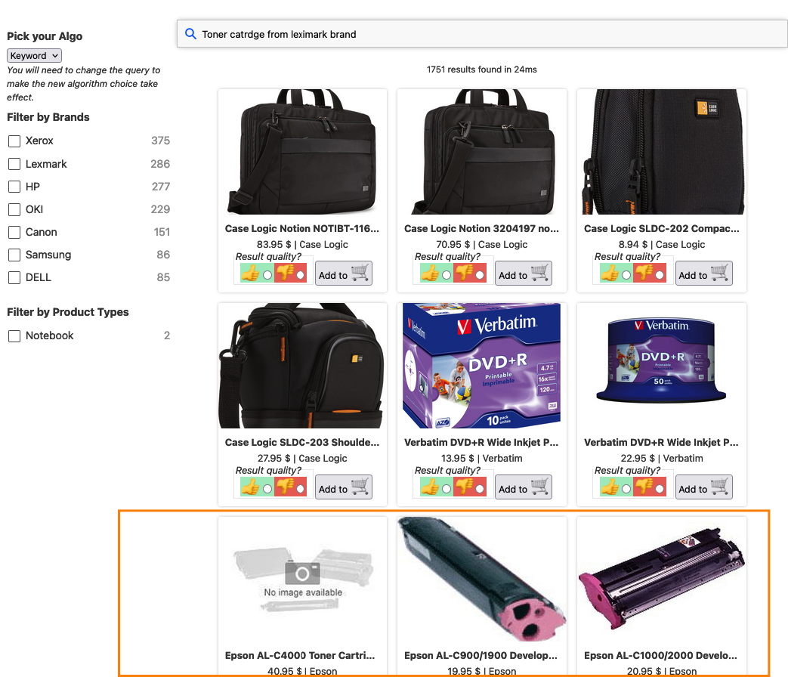

# Kata 005: Hybrid search

We've noticed that our users of the Chorus Electonics website are truly terrible at spelling, for example this query: __Toner catrdge from leximark brand__ is returning laptop cases:

Notice that the first toner cartridge is in the third row, and it's an Epson brand!

This is a great use case for vectors, aka neural search.  They can really improve the matching, without the complexity of more traditional spellcheck type approaches:

To run this Kata, we're trying something new, we're going to use a Jupyter Notebook as there are a lot of commands to run to set up hybrid search in OpenSearch.

_WARNING_  This Kata requires Opensearch 2.18 with Multi-Search, which means we disabled UBI to make it work with a nightly build.

To get started you need to have a recent Python version.

1. Open a terminal and change to the katas directory: `cd ./katas`

1. We're going to use a "Virtual Environment" to organize everything: `python3 -m venv .venv`

1. Now start up the env: `source .venv/bin/activate`

1. Lastly, install all the required libraries: `pip install -r requirements.txt`

Great!  You are all set up.   Now to fire up the Jupyter notebook run: `jupyter notebook 005_2_run_a_hybrid_search.ipynb`

Once you are done, check out the
