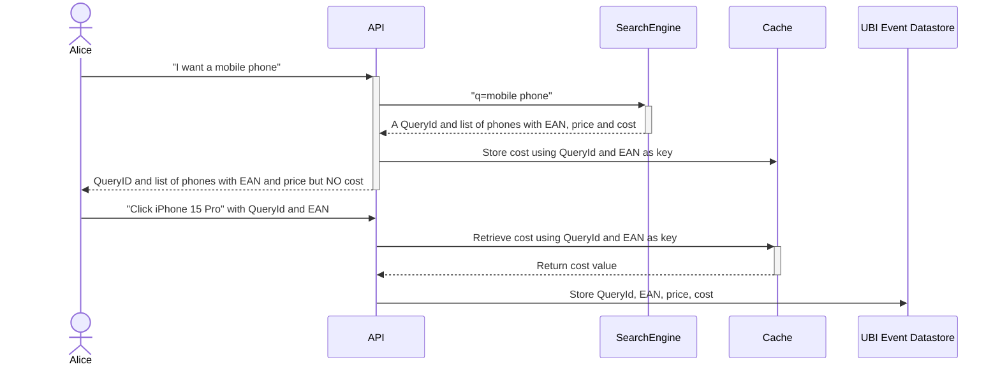

# Kata 5: Protecting Sensitive Information

You have deployed UBI successfully, and reveling in all the great information that you are collecting on what users are doing.

Then, one of your Vice President's asks, how is our conversion rate doing, and can you tell me what the margin is for the products that users are clicking on.

(Apparently he heard that we are juicing our conversion rate by only showing low margin cheap products, which is pushing down our average order basket size!)

We already know the price of the item, but we don't know what the cost of the items is.  If we started tracking cost then we could calculate the margin and start monitoring that:

### Formula for Margin

`Margin = (Price - Cost) / Price × 100`

However, while we are okay with sharing the price of items with our users, we do NOT want to share the cost of those items, and therefore our margins with them!

What to do?  Every query we make returns a set of product results, and it's all stored in the browser so we can record that information when you make your clicks and other actions for tracking in the `ubi_events` index.

Welcome to the __Panama Canal__.

The idea behind the Panama Canal is that it's a short cut.

"You get part of the key, but not all of it"..   Need something.

You can store sensitive data in a private cache, and then later, when an action happens, look it up and use it to complete the full UBI event dataset that you want to store.

For example, let's store the cost of our mobile phones under the EAN (European Article Number).   EAN is similar to the SKU's that you may be familiar with.



The key for your data in the cache is a combination of the QueryId and the primary key of your document, in our case we are using EAN.

## How it's Implemented

We have a field `primary_ean` defined in the schema that represents for a product the EAn to reference.

In the file `middleware/app.py` we are using just a simple in memory hash: `cache = {}`.

As part of the proxied method we have defined for search:

```python
@app.route("/ecommerce/_search", methods=["GET"])
def search():
```

We are extracting the cost information for each document, storing it, and removing it from what we send on to the front end:

```python
for hit in search_response["hits"]["hits"]:
    ean = hit["_source"]["ean"][0]
    cost = hit["_source"]["cost"]
    del hit["_source"]["cost"]

    # Cache cost for products.
    cache[ean] = cost
```


show the query to OS and getting back cost

show the same query via middleware and not getting the cost back.

Then do a event to the middleware..  and look it up in ubi_events with cost data as a screenshot./
