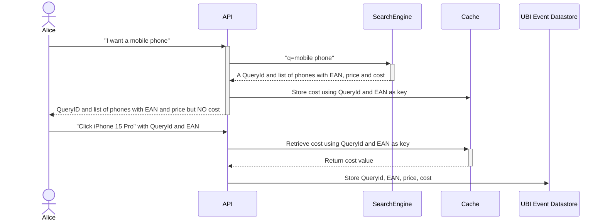
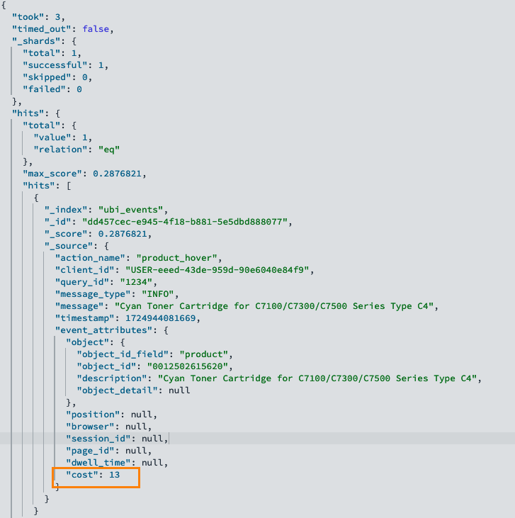

# Kata 5: Protecting Sensitive Information

You have deployed UBI successfully, and reveling in all the great information that you are collecting on what users are doing.

Then, one of your Vice President's asks, how is our conversion rate doing, and can you tell me what the margin is for the products that users are clicking on.

(Apparently he heard that we are juicing our conversion rate by only showing low margin cheap products, which is pushing down our average order basket size!)

We already know the price of the item, but we don't know what the cost of the items is.  If we started tracking cost then we could calculate the margin and start monitoring that:

### Formula for Margin

`Margin = (Price - Cost) / Price × 100`

However, while we are okay with sharing the price of items with our users, we do NOT want to share the cost of those items, and therefore our margins with them!

What to do?  Every query we make returns a set of product results, and it's all stored in the browser so we can record that information when you make your clicks and other actions for tracking in the `ubi_events` index.

Welcome to the __Panama Canal__.

The idea behind the Panama Canal is that it's a short cut.

"You get part of the key, but not all of it"..   Need something.

You can store sensitive data in a private cache, and then later, when an action happens, look it up and use it to complete the full UBI event dataset that you want to store.

For example, let's store the cost of our mobile phones under the EAN (European Article Number).   EAN is similar to the SKU's that you may be familiar with.



The key for your data in the cache is a combination of the QueryId and the primary key of your document, in our case we are using EAN.

## How it's Implemented

We have a field `primary_ean` defined in the schema that represents the EAN to use as the unique identifier for a product.

In the file `middleware/app.py` we are using just a simple in memory hash: `cache = {}` to store the sensitive data.

We proxy connections to OpenSearch through the middleware in order to prevent the browser from recieving the sensitive data,
but also to add it back into the full UBI Event data before storing it in the UBI Event datastore.

```python
@app.route("/ecommerce/_search", methods=["GET","POST"])
def search():
```

We are extracting the cost information for each document, and storing it under a key formed of the UBI Query Id and the EAN of the product.

```python
for hit in search_response["hits"]["hits"]:
    ean = hit["_source"]["primary_ean"]
    cost = hit["_source"]["cost"]
    del hit["_source"]["cost"]

    # Cache cost for product based on QueryId + EAN
    cache[f"{ubi_query_id}-{ean}"] = cost
```

Here is an example curl command that sends a search through the proxy, notice the results do not have the _cost_ attribute.

```bash
> curl -X GET http://localhost:9090/ecommerce/_search -H "content-type: application/json" --data '{"ext": {"ubi": { "query_id": "1234"}}, "query": {"match_all": {}}}'

Notice that we are not returning the cost field from the API, but still including our UBI data that we need for tracking?

```json
{
  "hits": {    
    "hits": [
        "_index": "ecommerce",
        "_id": "968447",
        "_score": 1.0,
        "_source": {
          "id": "968447",
          "name": "Cyan Toner Cartridge for C7100/C7300/C7500 Series 'Type C4'",
          "title": "OKI Cyan Toner Cartridge for C7100/C7300/C7500 Series 'Type C4' Original",
          "ean": [
            "0051851351049"
          ],
          "short_description": "Cyan Toner Cartridge for C7100/C7300/C7500 Series 'Type C4'",
          "img_high": "http://images.icecat.biz/img/norm/high/968447-3338.jpg",
          "img_low": "http://images.icecat.biz/img/norm/low/968447-3338.jpg",
          "img_500x500": "http://images.icecat.biz/img/gallery_mediums/img_968447_medium_1480985748_8727_5647.jpg",
          "img_thumb": "http://images.icecat.biz/thumbs/968447.jpg",
          "date_released": "2007-08-09T00:00:00Z",
          "supplier": "OKI",
          "price": 20395,
          "attr_t_type": "Original",
          "attr_t_printing_colours": "Cyan",
          "attr_n_colour_toner_page_yield": 10000.0,
          "attr_b_colour": true,
          "primary_ean": "0051851351049"
        }
      }
    ]
  },
  "ext": {
    "ubi": {
      "query_id": "1234"
    }
  }
}
```

The same query directly to OpenSearch returns the sensitive data that we don't want to expose to the browser:

```json
{
    "_index": "ecommerce",
    "_id": "968447",
    "_score": 1.0,
    "_source": {
      "id": "968447",
      "name": "Cyan Toner Cartridge for C7100/C7300/C7500 Series 'Type C4'",
      "title": "OKI Cyan Toner Cartridge for C7100/C7300/C7500 Series 'Type C4' Original",
      "ean": [
        "0051851351049"
      ],  
      ...
      "primary_ean": "0051851351049",
      "cost": 8649
    }
```

A quick dump of our cache shows that we are storing the cost data (in pennies) using the combination of the Query Id, `1234` and the product EAN.
```bash
curl -X GET http://localhost:9090/dump_cache                                                                                                                               
```

which returns:
```json
{
  "cache": {
    "1234-0012502615620": 13,
    "1234-0051851351049": 8649,
    "1234-0065030815772": 95,
    "1234-0095205603217": 3248,
    "1234-0731304213239": 47998,
    "1234-0731304258193": 45785,
    "1234-0882780985407": 4941,
    "1234-0884420588030": 3170,
    "1234-4008705042628": 1961,
    "1234-5055288404878": 369
  }
}
```

Now let's simulate a product_hover event from the front end:

```bash
curl -X PUT http://localhost:9090/ubi_events -H "Content-Type: application/json" -d'
[
  {
    "action_name": "product_hover",
    "client_id": "USER-eeed-43de-959d-90e6040e84f9",
    "query_id": "1234",
    "message_type": "INFO",
    "message": "Cyan Toner Cartridge for C7100/C7300/C7500 Series Type C4",
    "timestamp": 1724944081669,
    "event_attributes": {
        "object": {
            "object_id_field": "product",
            "object_id": "0012502615620",
            "description": "Cyan Toner Cartridge for C7100/C7300/C7500 Series Type C4",
            "object_detail": null
        },
        "position": null,
        "browser": null,
        "session_id": null,
        "page_id": null,
        "dwell_time": null
    }
  }
]'
```


Now go check in the `ubi_events` collection for the event you just sent in, and you'll see the complete event with the *cost* information added back in:

```json
GET /ubi_events/_search
{
  "query": {
    "match": {
      "query_id": "1234"
    }
  }
}
```


