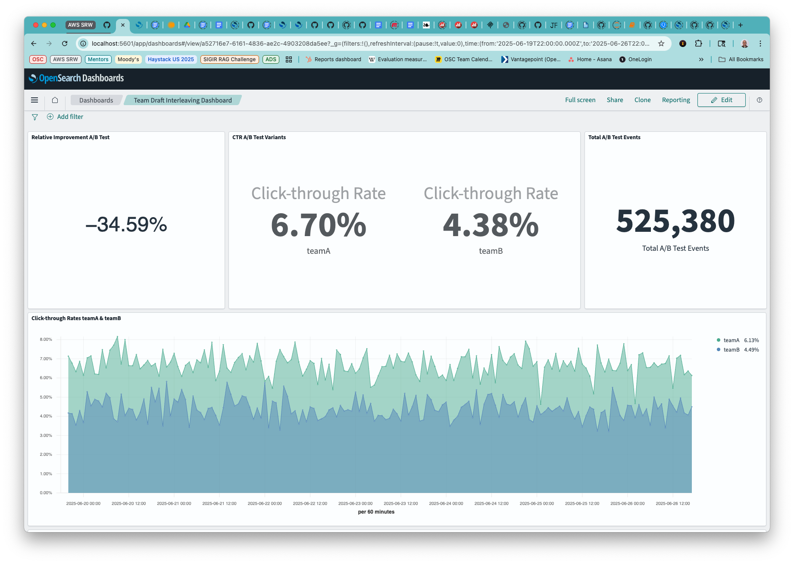

# Kata 007: Configuring an AB test with Team Draft Interleaving
[Team Draft Interleaving](https://dl.acm.org/doi/abs/10.1145/2806416.2806477) is an algorithm for A/B testing that presents a single result list to each user, with the competing search algorithms both represented in the list. This facilitates faster A/B testing, as the user pool is not divided into treatment groups.

This form of A/B testing requires no external orchestration, front-end modification, nor third-party instrumentation.

The Search Relevance Workbench provides us with the competing search algorithms, the search configurations for the A and B arms of the test.

Given the two test arms, the “AB algorithm” submits each search configuration and gathers the result lists for each. Next, the TDI algorithm produces a single merged result list. The result items will be annotated with the name of the search configuration that produced them. UBI events generated from the returned results list have that value included in the event enabling analysis and visualization of the experiment results.

## Prerequisites
_WARNING_  This Kata requires Opensearch 3.1 with the UBI and SRW plugins enabled.

### Optional Jupyter notebook setup
As with kata 005_1, you can optionally use a jupyter notebook to interact with the data.
To get started, you need to have a recent Python version.

1. Open a terminal and change to the katas directory: `cd ./katas`

1. We're going to use a "Virtual Environment" to organize everything: `python3 -m venv .venv`

1. Now start up the env: `source .venv/bin/activate`

1. Lastly, install all the required libraries: `pip install -r requirements.txt`

Or:

```
cd ./katas
python3 -m venv .venv
source .venv/bin/activate
pip install -r requirements.txt
jupyter notebook 007_Interleave.ipynb
```
Note, Chorus must still be set up.

### Quick Start
Use `quickstart.sh` to run the Chorus setup. 
To explore Team Draft Interleaving we recommend running the quickstart.sh script with the full data set option:

```% ./quickstart.sh --full-dataset```

It will perform the following tasks:
* Create and start the docker containers for
  * OpenSearch 3.1
  * OpenSearch 3.1 dashboards
  * Chorus middleware
  * Chorus reactive search

* Download and transform the ESCI product data set
* Update the ML plugin and install a model group for neural search
* Create the ingestion pipeline to use that model
* Index the full product data set
* Create the neural and hybrid search pipelines
* Update the index with embeddings
* Install the UBI dashboard
* Install the TDI dashboard
* Create two Search Relevance Workbench Search Configurations
* Create and start the dataprepper docker container

### UBI

To create sampled UBI queries and synthetic UBI events, clone the ESCI data repo:
[ESCI data set](https://github.com/amazon-science/esci-data.git)

and [User Behavior Insights](https://github.com/opensearch-project/user-behavior-insights/)
and use the 
[UBI Data Generator](https://github.com/opensearch-project/user-behavior-insights/tree/main/ubi-data-generator).
Provide the command line argument for the path to the ESCI data set, with judgments, and create a set of queries and associated UBI events.

```
python ubi_data_generator.py --esci-dataset ../../esci-data/shopping_queries_dataset --num-unique-queries 1000 --num-query-events 100000 --generate-opensearch --datetime-start=2025/06/20 --time-period-days=7
```
### SRW

The Search Relevance Workbench must be enabled in OpenSearch 3.1. See [Search Relevance Tools](https://github.com/opensearch-project/dashboards-search-relevance) 
for the Dashboard setting.

This step must be performed manually.

Additionally, the plugin must be enabled.

The following API calls are all handled in the `quickstart.sh` for you and mainly included for your reference in case you want to follow along with the steps manually.

`quickstart.sh` executes the following curl command.

```
curl -X PUT "http://localhost:9200/_cluster/settings" -H 'Content-Type: application/json' -d'
 {
   "persistent" : {
    "plugins.search_relevance.workbench_enabled" : true
  }
}'
```


#### Search Configurations

See [SRW Search Configs](https://docs.opensearch.org/docs/latest/search-plugins/search-relevance/search-configurations/)
for how to manually create search configurations.  For this kata, only two search configurations are required.

`quickstart.sh` executes the following curl commands.
```
curl -s -X PUT "http://localhost:9200/_plugins/_search_relevance/search_configurations" \
-H "Content-type: application/json" \
-d'{
"name": "baseline",
"query": "{\"query\":{\"multi_match\":{\"query\":\"%SearchText%\",\"fields\":[\"id\",\"title\",\"category\",\"bullet_points\",\"description\",\"brand\",\"color\"]}}}",
"index": "ecommerce"
}'
```

```
curl -s -X PUT "http://localhost:9200/_plugins/_search_relevance/search_configurations" \
-H "Content-type: application/json" \
-d'{
"name": "baseline with title weight",
"query": "{\"query\":{\"multi_match\":{\"query\":\"%SearchText%\",\"fields\":[\"id\",\"title^25\",\"category\",\"bullet_points\",\"description\",\"brand\",\"color\"]}}}",
"index": "ecommerce"
}'
```

## Configuring an AB test

Now that [Chorus](http://localhost:3000/) is up and running, load up the home page.
On the left hand side, select AB from the Pick your Algo drop down menu:


Two text entry boxes will appear. In the first, enter `baseline` and in the second enter
`baseline with title weight`


Now, when you enter a query in the search box, both chosen configurations will be executed, with their result lists interleaved.

Now, when you enter a query in the search box, both chosen configurations will be executed, with their result lists interleaved. As shown below, the query spiderman produces a total of 5 results. Inspecting the items, you can see that the algorithm interleaving began with configuration B.
1. baseline with title weight
1. baseline
1. baseline with title weight
1. baseline
1. baseline


Running the query a second time may yield baseline as the first item.


## Visualizing an A/B test.

If you just can't wait for the results to accumulate, you can use the synthetic UBI events generated to view a week-long AB test of TeamA vs TeamB in the TDI Dashboard.




Congratulations! You now have Chorus - The OpenSearch Edition configured to run an AB test configuration!
